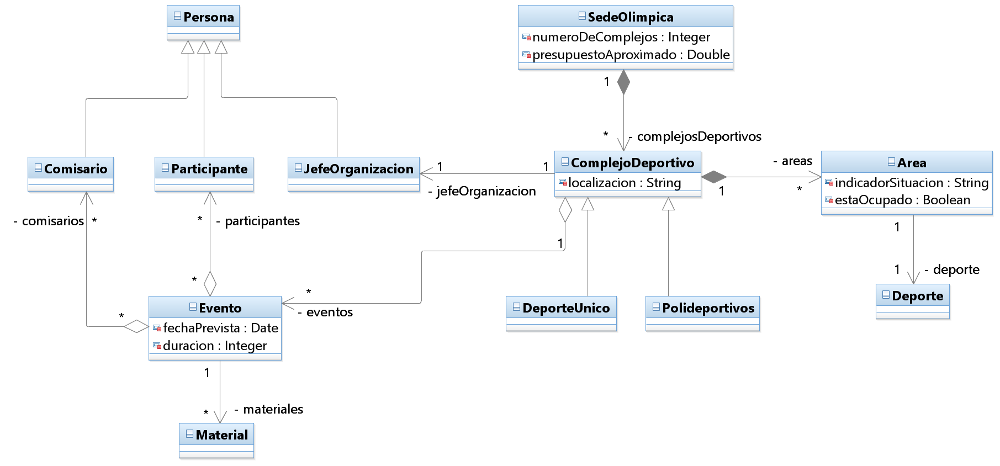
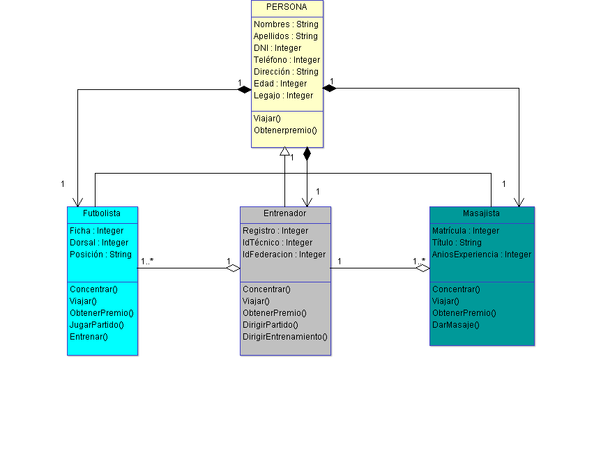

# ***PARCIAL Nº 1***
## **Trabajo Práctico Integrador**
### *Alumno: Lucas Matías Quiroga*

# ***Actividades***:
### 1- Explicar y ejemplificar Composición y Agregación.
### 2- Explicar que es Polimorfismo.
### 3- Dar un ejemplo de la vida real de Polimorfismo, con su diagrama de clases y explicación.
### 4- Codificar en Javascript el ejemplo del punto 2.

1- Para poder definir que es composición y agregación, debemos comenzar por el principio, que es definir que es la asociación.

- Asociación: Es generalmente, una relación estructural entre clases, es decir, la navegalidad nos muestra donde esta ubicado el atributo. 

- AGREGACIÓN: Se podría decir que la agregación es un tipo de asociación entre una clase y los diferentes valores que la componen. Nos indica que una clase, al ser parte de la otra, pueden compartir y eliminar varios compuestos de ella.

- COMPOSICIÓN: Es una relación que representa a objetos compuestos por otros objetos. El objeto en el nivel superior de la jerarquía es el todo y los que están en los niveles inferiores son sus partes o componentes.

Ejemplo:
- Las sedes olímpicas se dividen en complejos deportivos. Los complejos deportivos se subdividen en aquellos en los que se desarrolla un único deporte y los polideportivos. Ambos tipos manejan diferente tipo de información. Por cada sede se almacena el número de complejos que tiene y su presupuesto aproximado.
Los complejos tienen áreas designadas para cada deporte con un indicador de su situación (ejemplo: centro, esquina N-E, etc.).
Un complejo tiene una localización, un jefe de organización y el área ocupada. Cada complejo celebra una serie de eventos (ejemplo: la pista del estadio puede celebrar muchas carreras distintas)
Cada evento tiene prevista una fecha, duración, número de participantes y número de comisarios. Para cada comisario se almacena la lista de eventos en los que está involucrado. Para cada evento se guarda el material necesario para su desarrollo (porterías, pértigas, barras paralelas).

2-
- Polimorfismo: Se denomina polimorfismo a la capacidad que tienen los objetos de una clase de responder al mismo mensaje o evento en función de los parámetros utilizados durante su invocación. Es una entidad que puede contener valores de diferentes tipos durante la ejecución del programa. La misma se utiliza a travez de herencia, con 2 o mas clases o atributos de la misma.

3-
- El Presidente de un equipo de Fútbol decide abonar los premios a la plantilla total, compuesta por jugadores, técnico y masajista, debido al gran rendimiento que han tenido a lo largo de la temporada. El total a abonar es de $2.500.000 de pesos, que el 40% corresponden a los jugadores, por el desempeño y clasificar a las copas internacionales (salieron entre el 2do y 5to puesto). Al técnico le corresponde el 35%, porque agarró el equipo en zona de descenso directo y los clasificó a dichos torneos, además de potenciar a los jugadores y las inferiores. Al masajista le corresponde un 25%, porque mantuvo al equipo en un gran nivel y solo tuvieron lesiones menores, de rápida recuperación.

